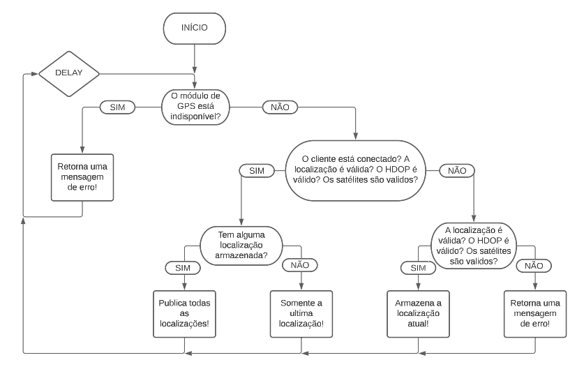
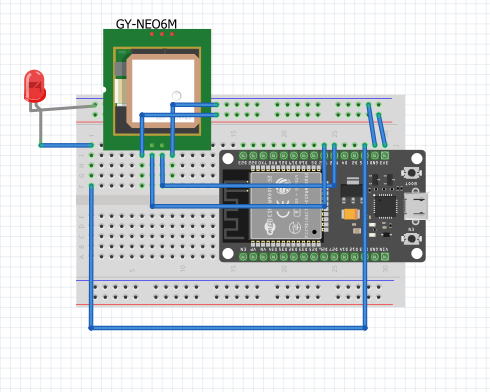

# Tracker
 Projeto de rastreador de geolocalização utilizando módulos GPS NEO-6M e o microcontrolador ESP32.

# 1. Dispositivos e recursos necessarios

- Protoboard
- LED
- ESP32 ESP-WROOM-32 DEVKit V1
- Módulo GPS NEO-6M Com Antena
- Fios

# 2. Parâmetros

| CONSTANTES        | Descrição                                                                              |
| ----------------- | -------------------------------------------------------------------------------------- |
| RXD2              | Pino RXD2 do ESP32. Obs: deve ser conectado ao TX do GPS                               |
| TXD2              | Pino TXD2 do ESP32. Obs: deve ser conectado ao RX do GPS                               |
| GPS_BAUDRATE      | A taxa de transmissão de bits de um sinal serial para o GPS. Obs: Geralmente é de 9600 |
| WIFI_SSID         | SSID da rede WiFi                                                                      |
| WIFI_PASSWORD     | Senha da rede WiFi                                                                     |
| MQTT_SERVER       | Endereço do servidor MQTT                                                              |
| MQTT_PORT         | Porta do servidor MQTT                                                                 |
| MQTT_TOPIC_PREFIX | Prefixo do tópico MQTT para publicar as coordenadas                                    |
| MQTT_USERNAME     | Usuario do servidor                                                                    |
| MQTT_PASSWORD     | Senha do usuario do servidor                                                           |
| LED               | Pino referente ao LED interno do ESP32                                                 |
| LED_EXT           | Pino referente ao LED externo ao ESP32 que será utilizado. Obs: verificar o datasheet  |
| DELAY             | Delay em milissegundos (ms) para envio de dados. Ex: 5*1000 = 5 segundos               |


# 3. Loop

Para ajudar no entendimento, criou-se este fluxograma referente a função Loop()



# 4. Conexão

Aqui é um exemplo de como deve ser feita a conexão dos dispositivos



# 5. Dto's

```json
    {
        "device": "esp32",
        "sensor": "esp32-00:00:00:00:00:00",
        "cordinates":{
            "lat":"0.000000",
            "lon":"0.000000"
        }
    }
```

```json
    [
    {
        "device": "esp32",
        "sensor": "esp32-00:00:00:00:00:00",
        "cordinates":{
            "lat":"0.000000",
            "lon":"0.000000"
        }
    },{
        "device": "esp32",
        "sensor": "esp32-00:00:00:00:00:00",
        "cordinates":{
            "lat":"0.000000",
            "lon":"0.000000"
        }
    }
    ]
```